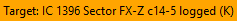
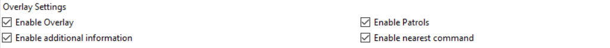
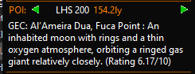
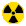

# EDMC-Canonn
EDMC plugin to automatically collect accurate science data from the galaxy and coordinate missions

# Features

## System Target Info

If you select a target system on the galaxy map using the "Set Target" button. The plugin will check if the system has been logged in Spansh.

| Example | Description |
|-----------------|-------------------------------------------------------------|
|  | The system is not in Spansh | 
|  | The system coordinates are in Spansh but no bodies | 
|  | The system is in Spansh and some bodies scanned | 
|  | The system is in Spansh and all bodies scanned | 

NB: While using this can increase your chances of finding unexplored systems it isn't perfect as not all commanders will contribute to Spansh.

| Icon | Description
|---------------------------|--------------------------------------------------|
|  | Clicking on the save icon will save some system details to a csv file|
|  | Clicking on this icon will open the csv file in notepad
|  | Clicking here will fetch the codex data for the system and display it in place of the current system. Clicking again will restore the current system.

The csv file can be found in %APPDATA%\EDMarketConnector\canonn\target.csv or equivalent for your system.

## Overlay

The EDMC-Canonn plugin can be combined with [EDMC-Overlay](https://github.com/inorton/EDMCOverlay#readme) or [EDMC-Overlay2 for linux ](https://github.com/sersorrel/edmcoverlay2#readme) to display text overlaid on the game screen. 

Just install the EDMC-Overlay plugin as you would any other plugin and enable the overlay options in the Canonn Plugin settings.

* Enable Overlay: If selected enables the overlay
* Enable Patrols: Displays the patrol text as an overlay
* Enable Nearest Command: Displays the text from the "nearest" command results on screen
* Enable Additional Information: Does what it says on the tin

The positon of the text on screen can be configured by editing a json file. For details see [overlay.md](overlay.md)

## POI System
The POI system is used for directing people to places of interest to Canonn and for providing some useful location information. The POI section will display the nearest location to the commander position. Patrols are not automaticaly updated they only get loaded on statup of after going into the configuration screen
 
 * Canonn patrols usually consist of locations where data is incomplete. 
 * Canonn Influence Patrol: This tells you where systems have a Canonn Presence and gives some informatio about the current state
 * Galactic Mapping POIs show you the nearest Galactic mapping project entry.
 * Thargoid Sites show you the location of the nearest site and its type. 
 * Guardian Sites shows you the nearest guardian site 

You can now store your own personal POIs in a CSV file. The column headings are the same as you would see if you downloaded csv from a body search in spansh. It requires a minimum of "System Name","X","Y,"Z" and either "Description" or "Subtype" columns.
If "Description" is not Supplied then it will use "Subtype" if available or will just display "Personal POI" 

You can Supply the description column to describe your POI. 

The file must be called my_patrol.csv and is located in the canonn directory one level below the plugin folder

e.g. C:\Users\\**YOURUSER**\AppData\Local\EDMarketConnector\canonn

### Usage
* Click on the green arrows to see next or previous POI.
* Click on the POI message to open a web page associated with the POI
* Click on the System Name to visit the EDSM page for the system

If you wish to create POI lists for inclusion then please read [POI_API.md](POI_API.md)

**If the `Enable Patrols` setting in EDMC-Canonn settings overlay section is enabled, patrols will be displayed when entering a system or when patrols are refreshed**

## Search Nearest
It is now possible to type a search command in the in game message box. NB: The search command will be visible to local players but the response will not. The search results will be stored in the POI section of the plugin in place of any POI. Right clicking on the system name will allow you to copy to the clipboard. 

NB: Data is only updated once per day so may not be completely accurate.

**If the `Enable nearest command` setting in EDMC-Canonn settings overlay section is enabled, the result of the nearest command will be displayed**

| Command                                  | Example                         | Description                                                                                                                                                                                                                                                  |
|------------------------------------------|---------------------------------|--------------------------------------------------------------------------------------------------------------------------------------------------------------------------------------------------------------------------------------------------------------|
| `nearest [station_service]`              | nearest Universal Cartographics | This will search for the nearest station service. Service names are [listed on spansh](https://spansh.co.uk/api/stations/field_values/services). The plugin also maintains some convenient aliases eg nearest vista is equivalent to nearest vista genomics. |
| `nearest buying [quantity] [commodity]`  | nearest buying 700 tritium      | This will search for the nearest system with demand for a commodity higher than the specified quantity. (If the quantity is ommited it will default to 790)                                                                                                  |
| `nearest selling [quantity] [commodity]` | nearest selling 700 tritium     | This will search for the nearest system with demand for a commodity higher than the specified quantity. (If the quantity is ommited it will default to 790)                                                                                                  |
| `nearest challenge`                      | nearest challenge               | This command will look for the nearest codex entry that you have not yet visited.                                                                                                                                                                            |
| `nearest [economy] economy`              | nearest prison economy          | Searches for the nearest station with the supplied economy.                                                                                                                                                                                                  |
| `nearest [allegiance] allegiance`        | nearest empire allegiance       | Searches for the nearest system with the supplied allegiance.                                                                                                                                                                                                |
| `nearest [allegiance] station`           | nearest federation station      | Searches for the nearest station with the supplied allegiance.                                                                                                                                                                                               |
 
## Canonn News Feed
See the top stories on rotation. Click on "Canonn" to advance to the next headline. Click on the headline to open the web page.

## Hyperdiction reporting 
Hyperdiction reporting is logged from the Thargoid Encounter Stats screen. There is also a button in the settings which will allow you to upload all hyperdictions from your journal. 

## NHSS Reporting
This captures NHSS information from the FSS scanner and USS Drops. Only logs one instance of each threat level per system.

## Codex Icons

The plugin will look up EDSM and Canonn Databases to identify interesting facts about the system and display icons that show you what is in the current system.  This may be biology, geology or system features such as earth like worlds, shepherd moons and close orbits. It will also show you how many bodies are recorded in EDSM and how many bodies there are in total. It also shows you Jumponium materials. Hover over the icons in game for a dropdown list. You can click on an icon to keep the list view always visible.

| Icon | name | Description |
|---|-----------------|---------------------------------------------------------------------------------------|
|  | System Mode | Displayed when in system mode. 
|  | Automatic Mode | Modes will automatically switch when in a body or leaving a body.
|  | Planet Mode | An extra layer of icons are displayed for individual planets
|  | Missing Data | This is displayed if there is data that needs capturing.
|  | Biology | This shows which species are present on each planet.
|  | Geology | This shows what types of geological activity is present on each planet.
|  | Anomaly | Displayed when there are anomalies in Notable Stellar Phenomena.
|  | Cloud | Displayed when there are Lagrange Clouds and Contents in Notable Stellar Phenomena.
|  | Guardian | Guardian beacons and ruins have been found in system.
|  | Thargoid | Thargoid surface sites and barnacles are in the system.
|  | Human | Human structures and fleet carriers are present. 
|  | High Value Planets | High value planets are found in system.
|  | Personal | Personal POIs recorded with the canonn capture command.
|  | Rings | Rings and their contents are displayed with this Icon.
|  | Tourist | Display notable facts about a system like collisions or unusual conditions.
|  | Tritium | Tritium is present in planetary rings.
|  | GreenSystem | All materials needed for premium jumponium synthesis can be found in the system.
|  | Jumponium | Displayed when materials needed for jumponium synthesis can be found in the system.
|  | Error | Usually displayed when there is a plugin error.

# Tourist Icons
                    
| name | Description
|-----------------------------------|------------------------------------------------|
| Close Flypast | Bodies that will pass close to each other but will never collide |
| Close Orbit | As above but not landable |
| Close Orbit Landable | A landable that orbits very close to another body |
| Close Ring Proximity | Rings of two bodies that may be close to each other |
| Collision Flypast | These bodies are on similar orbits and have a chance of colliding in the future. Ed observatory collisions plugin can confirm |
| Deeply Nested | This is based on the in game nomenclature. If the last three chars are lower case then it is deeply nested. This will cover stars as well |
| Eyeball Earthlike | An Earthlike world that always presents the same face to the sun |
| Fast Orbital Period | The orbital period should be less than an hour to qualify |
| Fast unlocked rotation | it rotates fast but is not tidally locked |
| Gas Giant with \[Ammonia\|Water\] based life| Strictly speaking any body type with life will show up her but it is only gas giants |
| Helium Gas Giant | To date, there have only been 15 Helium Giants found, and all but one of those are hand placed |
| Helium Rich Gas Giant | Gas giants that lost their hydrogen due to insufficient mass to hold onto it, or that their parent star was once hotter in the past, driving hydrogen off quicker than normal |
| Helium Rich System | Helium rich system indicates that the boxel may contain Helium Rich Gas Giants |
| High Density Rings | Rings that are very massive compared to size |
| High Gravity | High gravity landable bodies |
| Highly Eccentric Orbit | The orbit is closed to a straight line than a circle |
| Hot landable \[type\] | Hot landable bodies |
| Inner Moon | These are like shepherds but in between rings but not close enough to have cleared them |
| Landable Ringed Body | Landable bodies with rings. These can often have pretty views. |
| Large Radius Landable | Big landable planets |
| Large Radius Rings | Large rings in relation to the body size |
| Low Density Rings | Rings that have little mass compared to size |
| \[type\] Moon | moons that are these types: Earth-like world, Water world, Ammonia world |
| Moon Moon Moon | This looks for moons of moons of moons. It does not consider brown dwarves to be be planets so this is much rarer than you might think. |
| Ringed Star | Starts with rings. Now Excluded brown dwarfs |
| Ringed \[type\] | Ringed Workds that are  these types: Earth-like world, Water world, Ammonia world |
| Shepherd Moon | A moon that is close enough to the rings of the body it orbits to have cleared the orbit |
| Small Radius Rings | Small rings in relation to body size |
| Star as Moon | The game has designated the star as a moon (excluding brown stars) |
| Star as Planet | The game has designated the star as a planet (excluding brown stars) |
| Synchronous Orbit | Bodies that always show the same face to the body they orbit |
| Thin Rings | very narrow rings  AK| Taylor rings |
| Tiny Radius Landable | Tiny landable planets |
| Trojan | These are bodies on trojan orbits. They may be planets moons or suns |
| Walkable High Gravity | High gravity landable bodies you can walk on |

## Surface Navigation

If you are close to the surface of a planet you can send a message in the in game chat that will enable the plugin to display a bearing and distance to a set of coordinates

eg. canonn dest 0 0

## Surface data capture

Typing "canonn capture some text" into the in game chat will store your status.json in the database and effectively record a personal bookmark. This can be used for things like temperature surveys or recording surface coordinates for science projects. You can retrieve you data with this url, substituting your cmdr name https://us-central1-canonn-api-236217.cloudfunctions.net/get_cmdr_status?cmdr=LCU%20No%20Fool%20Like%20One

If the text after the words "canonn capture" start with the following ("guardian", "thargoid", "human", "biology", "geology", "other", "nsp") then that will be recorded as the category and the words after that will be stored as a comment.

eg: Canonn capture biology A rude looking tubus 

## Codex

We save code data to our database. 

We provide google sheets with much of the data held in the CAPI

* [Surface Biology](https://canonn.fyi/biosheet)
* [Guardian](https://canonn.fyi/guardiansheet)
* [Lagrange Clouds](https://canonn.fyi/cloudsheet)
* [Thargoid](https://canonn.fyi/thargoidsheet)

We also provide a csv for each of the codex entries showing which systems they are found in. Please seee the documentation for [Dumpr](https://github.com/canonn-science/Dumpr/blob/main/README.md) for links. 

All Codex data some FSS Events and SAA Signals are stored in a cloud mysql database and used for showing code icons. This data can be accessed through data dumps in compressed json format.

* [Codex Events](https://storage.googleapis.com/canonn-downloads/codex.json.gz)
* [FSS Events](https://drive.google.com/file/d/167wFlOrklf5tT2C1LtYGi8Ryjg-HpFXB/view?usp=sharing)
* [Signals](https://drive.google.com/file/d/1VyxpC3xux7A9oKYZ9xEApVND-CFeF_Lf/view?usp=sharing)

## Thargoid Kills 
This records Thargoids kills. What else did you expect herds of wilderbeast running through the serengeti?

## Journal Data
This records all journal entries that haven't specifically been excluded. NB the exclusion list needs to be bigger.

## FSS Data
This records FSSSignalDicovered Messages that havent beenexcluded. Also records AX Conflict Zones in their own model

## Carrier Location Data
This records FSSSignalDicovered from carriers. A public API will follow soon.

## Status Capture
This is a system that captures the status.json and stores it in the database with comments. 

## canonn dest
typing canonn dest <lat> <lon> will give you a bearing to that latitude and longitude that you can follow with colour on target indicators
